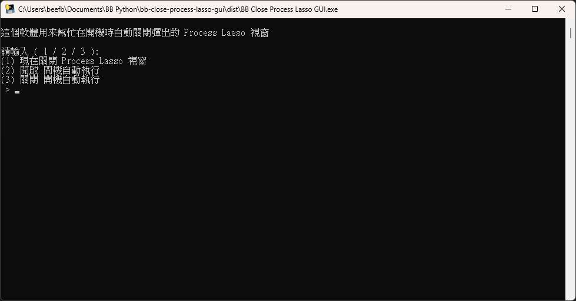

# BB Process Lasso 視窗關閉工具

免費版的 Process Lasso 會在開機後自動跳出一個視窗,  
前面幾十秒都不能關, 這個軟體用來幫忙強制關閉它  
缺點就是系統匣圖示也關閉了, 而且手動打開時還是需要等待那幾十秒  
不過, 設定只需要一次, 所以你通常也不會常常開啟它  

不會修改 Process Lasso 本體, 只是關閉視窗而已  

### 截圖



# 下載

### 到 Releases 下載最新版

- [BB Close Process Lasso GUI.exe](https://github.com/BeefBB/bb-close-process-lasso-gui/releases)

然後放到一個你不會移動的地方, 再執行它

# 備註

如果開機啟動失效了, 那通常是因為你移動了這個程式,  
請重新執行一次並選擇 (2) 開啟 開機自動執行  

# 想自己編譯?

## 執行

```bash
py -m venv .venv
.\.venv\Scripts\Activate.ps1
pip install -r requirements.txt
```
```bash
pyinstaller --noconfirm --onefile --uac-admin --name="BB Close Process Lasso GUI" bb-close-process-lasso-gui.py
```

打包後會在 `./dist`  

# 版權

MIT License  
